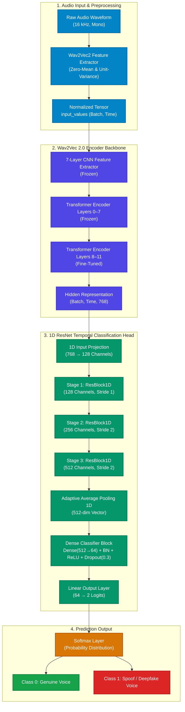

# Deepfake Voice Recognition

[](https://www.python.org/downloads/)
[](https://pytorch.org/)
[](https://huggingface.co/facebook/wav2vec2-base)
[](https://onnxruntime.ai/)
[](./LICENSE)

An end-to-end, production-grade deepfake audio and AI voice cloning detection system. Powered by fine-tuned **Wav2Vec 2.0** representations and a **1D ResNet temporal classification head**, this package offers automated dataset segmentation, mixed-precision training, comprehensive model evaluation, single-clip risk scoring, and optimized ONNX INT8 export for low-latency edge deployment.

---

## 📑 Table of Contents

- [Key Features](#-key-features)
- [Architecture Overview](#-architecture-overview)
- [Repository Structure](#-repository-structure)
- [Installation](#-installation)
- [Pretrained Weights](#-pretrained-weights)
- [Quick Start](#-quick-start)
  - [1. Audio Dataset Segmentation](#1-audio-dataset-segmentation)
  - [2. Model Training](#2-model-training)
  - [3. Evaluation & Metrics](#3-evaluation--metrics)
  - [4. Single-File Inference](#4-single-file-inference)
  - [5. ONNX Export & INT8 Quantization](#5-onnx-export--int8-quantization)
- [Python API Usage](#-python-api-usage)
- [Dataset Organization](#-dataset-organization)
  - [Dataset Download](#dataset-download)
- [Detailed Documentation](#-detailed-documentation)
- [License](#-license)

---

## 🚀 Key Features

- **Hybrid Representation Learning**: Leverages self-supervised speech acoustic embeddings from `facebook/wav2vec2-base` (or `wav2vec2-large-xlsr-53` for Indic languages) with the top 4 transformer layers fine-tuned.
- **1D ResNet Temporal Convolution Head**: Multi-stage residual network with adaptive average pooling designed to capture localized phase and spectral anomalies left by voice cloning vocoders.
- **Automated Audio Segmentation**: Standardizes multi-length, multi-format (`.wav`, `.mp3`, `.flac`, `.m4a`, `.ogg`) speech into uniform $4\text{ s}$ chunks with automatic zero-padding and $16\text{ kHz}$ mono resampling.
- **Resumable AMP Training**: Mixed-precision (`torch.amp`) acceleration with automatic recovery from checkpoints, early stopping, and CSV metrics logging.
- **Optimized ONNX CPU Deployment**: Exports to ONNX with dynamic batch/time axes and dynamic INT8 MatMul quantization for $2\times\text{--}3\times$ faster CPU inference.
- **Modular Design**: Works seamlessly as a standard CLI tool, an importable Python library, or interactive Jupyter/Colab notebooks.

---

## 🧠 Architecture Overview

<p align="center">
  
</p>



---

## 📁 Repository Structure

```
deepfake_voice_recognition/
├── assets/                          # Architecture schematics & visual diagrams
│   └── model_architecture.svg       # Vector architecture diagram
├── deepfake_voice_recognition/      # Core Python package (PEP 8 standard)
│   ├── __init__.py                  # Package exports & versioning
│   ├── __main__.py                  # Module CLI execution entrypoint
│   ├── main.py                      # Unified CLI parser (train, eval, predict, segment, export)
│   ├── config.py                    # Centralized settings & hyperparameters (cfg)
│   ├── segmenter.py                 # Audio dataset segmentation & resampling engine
│   ├── dataset.py                   # PyTorch Dataset, scanning, and DataLoader builders
│   ├── model.py                     # Wav2Vec2ResNetDetector architecture definition
│   ├── train.py                     # Mixed-precision training & checkpointing loop
│   ├── evaluate.py                  # Classification report & confusion matrix evaluation
│   ├── predict.py                   # Single-file deepfake risk scoring function
│   ├── export_onnx.py               # ONNX export and dynamic INT8 quantization
│   └── utils.py                     # Checkpoints, seed management, and plotting utilities
├── docs/                            # In-depth technical guides
│   ├── architecture.md              # Deep dive into network architecture & design
│   ├── dataset_pipeline.md          # Dataset preparation and preprocessing specifications
│   ├── cli_reference.md             # Complete CLI command and argument reference
│   └── onnx_deployment.md           # ONNX Runtime & edge CPU inference guide
├── notebooks/                       # Interactive Jupyter / Google Colab notebooks
│   ├── segment_audio_dataset.ipynb  # Interactive audio dataset chunking & inspection
│   ├── audio_deepfake_detection_dataset_prepared.ipynb
│   └── wav2vec2_resnet_deepfake_detection.ipynb
├── diagrams/                        # Source diagram definitions
│   └── model_architecture.drawio
├── .gitignore                       # Clean Git exclusion rules
├── pyproject.toml                   # Modern Python packaging definition
├── setup.py                         # Backward-compatible setuptools build script
├── requirements.txt                 # Project dependencies
└── README.md                        # Master repository documentation
```

---

## 📦 Installation

### From Source (Editable Mode)

```bash
# Clone the repository
git clone https://github.com/codebysumit/deepfake_voice_recognition.git
cd deepfake_voice_recognition

# Install dependencies and package in editable mode
pip install -e .
```

### Optional Dependencies (ONNX Runtime)

```bash
pip install -e .[onnx]
```

---

## 📥 Pretrained Weights

Pretrained model checkpoints are available for download from the `deepfake_voice_recognition_checkpoints` Google Drive folder:

**[Download Pretrained Weights](https://drive.google.com/drive/folders/1EHywemtBhQBpmlsPHGc6nG1vUN-li5Q1)**

The folder contains four files:

| File | Description |
|---|---|
| `checkpoint_best.pt` | PyTorch checkpoint with the lowest validation loss during training |
| `checkpoint_latest.pt` | Most recent PyTorch checkpoint, used to resume training |
| `model.onnx` | Converted ONNX model weights (FP32) |
| `model_quantized.onnx` | INT8-quantized ONNX model for faster, lighter CPU inference |

After downloading, place the checkpoint file(s) into a local `checkpoints/` directory (create it if it doesn't exist) so they can be referenced directly with the `--checkpoint` flag in the CLI commands below, e.g. `checkpoints/checkpoint_best.pt`.

---

## ⚡ Quick Start

The unified CLI provides access to all pipeline stages:

### 1. Audio Dataset Segmentation

Preprocess heterogeneous raw audio files into uniform 4-second $16\text{ kHz}$ segments:

```bash
deepfake-voice-recognition segment \
    --source-root ./data/raw \
    --output-root ./data/segmented \
    --segment-seconds 4.0 \
    --sample-rate 16000
```

### 2. Model Training

Train the detector with automatic checkpointing and mixed-precision acceleration:

```bash
deepfake-voice-recognition train \
    --dataset-root ./data/segmented \
    --epochs 40 \
    --batch-size 16 \
    --lr 2e-5
```

> **Resume Support**: If interrupted, re-running `train` automatically resumes training from `checkpoints/checkpoint_latest.pt`.

### 3. Evaluation & Metrics

Evaluate the best model checkpoint on the held-out test split:

```bash
deepfake-voice-recognition evaluate \
    --checkpoint checkpoints/checkpoint_best.pt \
    --dataset-root ./data/segmented
```

### 4. Single-File Inference

Predict whether an audio clip is genuine or AI-generated:

```bash
deepfake-voice-recognition predict \
    --audio ./samples/test_voice.wav \
    --checkpoint checkpoints/checkpoint_best.pt \
    --verbose
```

**Output:**
```
========================================
Deepfake Risk Score: 98.42%
Verdict            : SPOOF
========================================
```

### 5. ONNX Export & INT8 Quantization

Export trained PyTorch weights to FP32 and INT8 quantized ONNX graphs for production deployment:

```bash
deepfake-voice-recognition export \
    --checkpoint checkpoints/checkpoint_best.pt \
    --audio ./samples/test_voice.wav
```

---

## 💻 Python API Usage

You can import and integrate components directly into your own applications:

```python
import torch
from deepfake_voice_recognition import (
    Wav2Vec2ResNetDetector,
    cfg,
    get_risk_score,
)
from deepfake_voice_recognition.utils import load_model_for_inference

# 1. Load trained model for inference
model, checkpoint = load_model_for_inference(
    Wav2Vec2ResNetDetector,
    checkpoint_path="checkpoints/checkpoint_best.pt",
    device=cfg.device,
)

# 2. Estimate deepfake probability
risk_score, verdict = get_risk_score(
    model=model,
    device=cfg.device,
    audio_path="sample.wav",
)

print(f"Risk Score: {risk_score}% | Label: {verdict}")
```

---

## 📂 Dataset Organization

The system expects audio organized into `real` and `fake` directories, with optional language/speaker subfolders:

```
data/
├── raw/                         # Raw input files
│   ├── fake/
│   │   ├── Bengali/
│   │   └── English/
│   └── real/
│       ├── Bengali/
│       └── English/
└── segmented/                   # Output produced by 'segment' command
    ├── fake/
    │   ├── Bengali/
    │   │   ├── 101_01_Gemini_TTS.wav
    │   │   └── 101_02_Gemini_TTS.wav
    │   └── English/
    └── real/
        ├── Bengali/
        └── English/
```

### Dataset Download

The raw dataset is available for download from Google Drive:

**[Download Dataset](https://drive.google.com/drive/folders/1Z-NKkp1t7XbyKYVupEowB0N1gJO3aHKY)**

The folder contains a single archive, `indian-deepfake-voice.tar.gz`. Extract it into `./data/raw` (preserving the `real` / `fake` subfolder structure shown above) before running the `segment` command.

---

## 📚 Detailed Documentation

For in-depth guides and architectural references, consult the [docs/](./docs/) directory:
- [Architecture & Design Details](./docs/architecture.md)
- [Dataset Pipeline & Segmentation](./docs/dataset_pipeline.md)
- [CLI Reference Manual](./docs/cli_reference.md)
- [ONNX Edge Deployment & CPU Benchmarks](./docs/onnx_deployment.md)

---

## 📄 License

This project is licensed under the [MIT License](./LICENSE).
