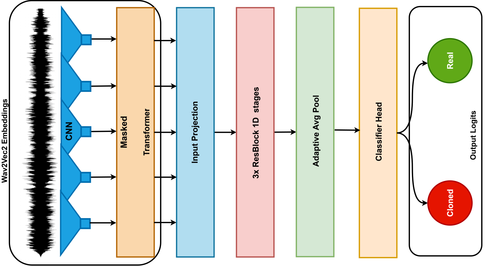
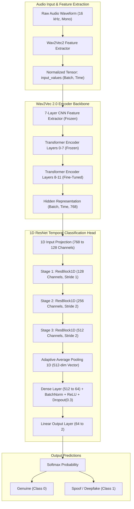

# Model Architecture & Design

This document details the machine learning architecture and design decisions powering **deepfake_voice_recognition**.

---

## 1. Architecture Diagram

---

## 2. Architecture Overview

The system combines self-supervised speech representations with temporal convolutional feature aggregation:

---

## 3. Wav2Vec 2.0 Backbone

- **Default Pretrained Model**: `facebook/wav2vec2-base` (or `facebook/wav2vec2-large-xlsr-53` for multilingual Indic speech).
- **Self-Supervised Pretraining**: Wav2Vec 2.0 learns rich acoustic and phonetic speech representations from thousands of hours of raw speech.
- **Layer-Freezing Strategy**:
  - The convolutional raw audio encoder is **frozen** to preserve fundamental acoustic filter banks.
  - The first 8 transformer layers are **frozen** to maintain generic speech phonetic representations.
  - The top **4 transformer layers** (`cfg.num_unfrozen_layers = 4`) are **fine-tuned** to adapt speech features to synthetic artifacts (vocoder phase discontinuities, spectral unnaturalness, robotic pitch jitter).

---

## 4. 1D ResNet Temporal Classification Head

While Wav2Vec2 outputs a sequence of frame-level representations $(B, T, D)$, audio deepfake detection requires capturing localized temporal anomalies.

### Residual Block (`ResBlock1D`)
Each block applies:
1. `Conv1d(in_ch, out_ch, kernel=3, padding=1, stride=stride)`
2. `BatchNorm1d(out_ch)`
3. `ReLU(inplace=True)`
4. `Conv1d(out_ch, out_ch, kernel=3, padding=1, stride=1)`
5. `BatchNorm1d(out_ch)`
6. Skip connection with $1 \times 1$ conv downsampling when dimensions or strides change.

### Multi-Scale Downsampling
- 3 stages downsample the time dimension while expanding channel capacity ($128 \to 256 \to 512$).
- Adaptive average pooling pools all temporal frames into a fixed 512-dimensional vector.
- Dense classification head with dropout (0.3) yields calibrated class logits.

---

## 5. Separation of Preprocessing & Forward Pass

A critical engineering design decision in `model.py` is keeping `model.preprocess()` **outside** the `forward()` method:
- **Hugging Face `Wav2Vec2FeatureExtractor`**: Uses NumPy-based normalization and padding which is not directly traceable by TorchScript or ONNX exporters.
- **Traceable `forward()`**: Accepts pure PyTorch `input_values` tensors $(B, T)$ and produces $(B, 2)$ logits.
- **Result**: Enables seamless ONNX export and TorchScript compilation for low-latency production deployment.
